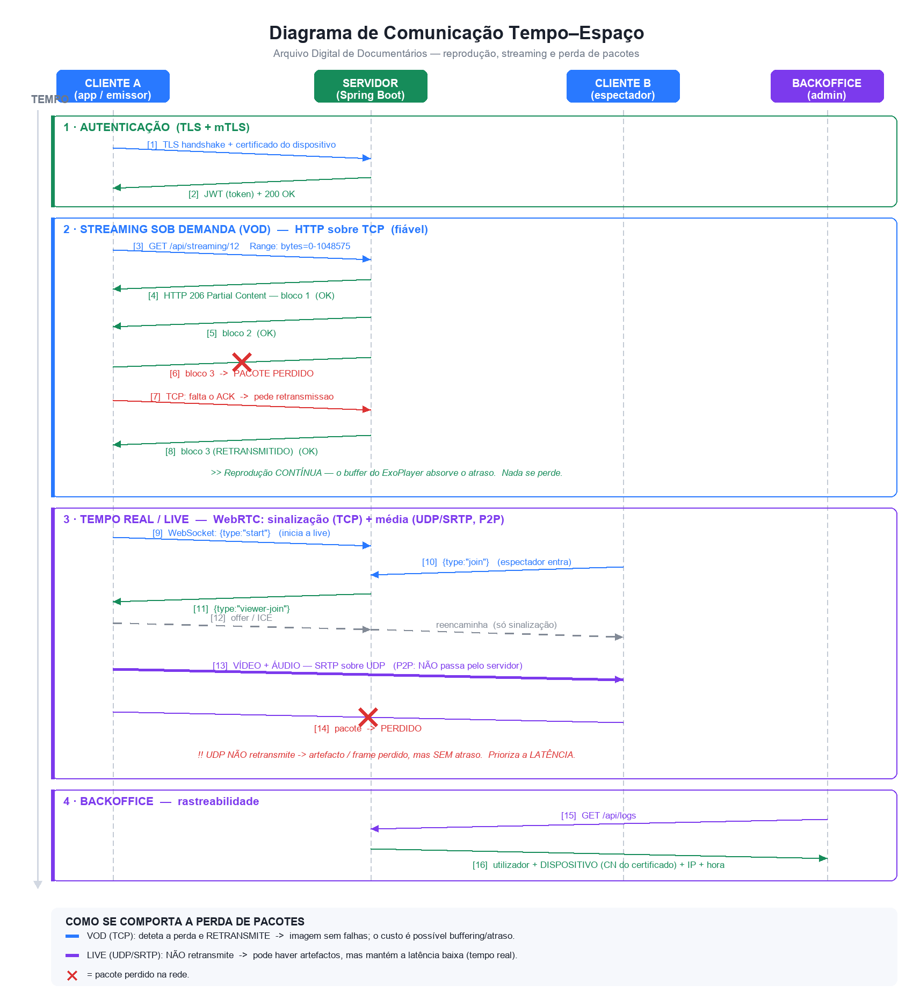

# 🎓 Roteiro de Defesa — Arquivo Digital de Documentários

**Grupo 06 | Projecto Final Multimédia 2026 | ISPTEC**

> **Como usar este documento:** cada secção tem
> 💬 **O que dizer** (a frase para a apresentação) ·
> 🔧 **O suporte técnico** (os factos, se ele quiser detalhe) ·
> ❓ **Se ele perguntar** (as perguntas prováveis e as respostas)

---

## Índice

1. [Abertura — o que construímos](#1-abertura--o-que-construímos)
2. [Desenvolvimento do projeto multimédia](#2-desenvolvimento-do-projeto-multimédia)
3. [Interface simples e acessível](#3-interface-simples-e-acessível)
4. [Disposição dos controlos e utilização de cores](#4-disposição-dos-controlos-e-utilização-de-cores)
5. [Autoria multimédia](#5-autoria-multimédia)
6. [Combinação de médias](#6-combinação-de-médias)
7. [Compressão — a técnica utilizada](#7-compressão--a-técnica-utilizada) ⭐
8. [Áudio e sincronização de áudio](#8-áudio-e-sincronização-de-áudio)
9. [Legendas — extração e sincronização](#9-legendas--extração-e-sincronização) ⭐
10. [Formatos e extensões (vídeo / áudio / legendas)](#10-formatos-e-extensões-vídeo--áudio--legendas)
11. [Streaming — por demanda e em tempo real](#11-streaming--por-demanda-e-em-tempo-real) ⭐
12. [Diagrama de comunicação tempo–espaço (reprodução e perda de pacotes)](#12-diagrama-de-comunicação-temporal-espaço) ⭐⭐
13. [Segurança com certificados](#13-segurança-com-certificados) ⭐
14. [Fecho — a frase final](#14-fecho--a-frase-final)
15. [Perguntas difíceis (e as respostas honestas)](#15-perguntas-difíceis-e-as-respostas-honestas)

---

## 1. Abertura — o que construímos

💬 **O que dizer:**
> *"Construímos uma plataforma completa de arquivo e streaming de documentários, com **três componentes**: uma **app Android** para os utilizadores, uma **API REST em Spring Boot** que centraliza a lógica e o processamento multimédia, e um **backoffice web** para administração. Não é só um leitor de vídeo — o sistema **processa** o conteúdo (comprime, gera capas e legendas automaticamente), **distribui** (streaming sob demanda e em tempo real) e **protege** (PKI com certificados por dispositivo)."*

🔧 **Os números:**
- Backend: Spring Boot 3.2.5 · Java 17 · PostgreSQL · ~15 controladores, ~13 serviços
- App: Android (Java), minSdk 24 · 18 ecrãs
- Backoffice: HTML/CSS/JS puro, servido pelo próprio backend

---

## 2. Desenvolvimento do projeto multimédia

💬 **O que dizer:**
> *"Seguimos uma arquitetura **cliente–servidor em três camadas**. Toda a **lógica multimédia vive no servidor** — é ele que comprime, extrai capas e gera legendas — para que o telemóvel não gaste bateria nem processamento. O cliente só **consome**."*

🔧 **Decisões de arquitetura que vale a pena defender:**

| Decisão | Porquê |
|---|---|
| Processamento **no servidor**, não no telemóvel | O telemóvel não tem potência nem bateria para transcodificar vídeo |
| Compressão **assíncrona** (`@Async`) | O upload responde em segundos (`PENDENTE`); a compressão corre em background. O utilizador não fica à espera |
| Estados explícitos: `PENDENTE → PROCESSANDO → PRONTO / ERRO` | O utilizador (e o admin) sabem sempre em que ponto está |
| **API REST partilhada** entre app e backoffice | Um único contrato, sem duplicação de lógica |

❓ **Se ele perguntar "porque não processam no cliente?"**
> *"Transcodificar H.265 num telemóvel demoraria minutos e consumiria bateria. E teríamos de confiar no ficheiro que o cliente enviasse — no servidor garantimos que **todos** os vídeos passam pelo mesmo pipeline."*

---

## 3. Interface simples e acessível

💬 **O que dizer:**
> *"Desenhámos a interface segundo o princípio de **carga cognitiva mínima**: o utilizador nunca tem mais de 5 opções principais à frente, e cada ecrã tem **um objetivo claro**."*

🔧 **Escolhas concretas de acessibilidade:**

| Princípio | Como o aplicámos |
|---|---|
| **Navegação previsível** | *Bottom navigation* com 5 itens fixos (Início · Pesquisa · Guardados · Minha Lista · Perfil) — sempre no mesmo sítio |
| **Alvos de toque grandes** | Botões com ≥ 48dp de altura (recomendação Material Design) |
| **Contraste** | Texto branco sobre fundo escuro (#080D1A) → rácio muito acima do mínimo WCAG AA (4.5:1) |
| **Modo claro e escuro** | O utilizador escolhe nas Definições — importante para baixa visão e para uso noturno |
| **Leitores de ecrã** | `contentDescription` em todos os ícones (ex.: `android:contentDescription="Visualizações"`) |
| **Legendas** | Geradas automaticamente → acessibilidade para surdos e para ambientes ruidosos |
| **Feedback imediato** | Estados de carregamento, mensagens de erro claras, ações otimistas (a UI responde já, sincroniza depois) |

💬 **Frase forte:**
> *"A acessibilidade não foi um extra — as **legendas automáticas** são, ao mesmo tempo, uma funcionalidade multimédia e uma funcionalidade de acessibilidade."*

---

## 4. Disposição dos controlos e utilização de cores

💬 **O que dizer:**
> *"Organizámos os controlos por **hierarquia visual**: a ação principal é sempre a mais destacada, e as secundárias ficam subordinadas."*

🔧 **Disposição (ecrã de Detalhe, como exemplo):**
```
1º  [ ▶ ASSISTIR ]        ← botão primário, largura total, alto contraste
2º  [ Guardar ]           ← secundário, cor neutra
3º   ♡ Favorito  ↗ Partilhar  + Minha Lista   ← terciários: ícone + label pequeno
```
> A ordem **descendente** reflete a frequência de uso: 90% dos utilizadores querem *assistir*.

🔧 **Paleta de cores e o seu significado (não é decoração — é informação):**

| Cor | Hex | Significado |
|---|---|---|
| 🔵 Azul (marca) | `#3B82F6` | Ações, elementos interativos, identidade |
| ⚫ Fundo escuro | `#080D1A` | Faz o **conteúdo (as capas) saltar** — como o Netflix/Disney+ |
| 🟢 Verde | `#10B981` | Sucesso (guardado, upload pronto) |
| 🔴 Vermelho | `#EF4444` | Erro, live a decorrer, ação destrutiva |
| 🟡 Âmbar | `#F59E0B` | Aviso, processamento |
| ⭐ Dourado | `#FFC107` | Classificação (estrelas) |

💬 **Justificação do fundo escuro:**
> *"Num arquivo de vídeo, o fundo escuro não é estética — é **funcional**. Reduz a fadiga visual, poupa bateria em ecrãs OLED, e faz com que as **miniaturas dos documentários** sejam o elemento mais brilhante do ecrã, atraindo naturalmente o olhar para o conteúdo."*

❓ **Se ele perguntar "e o daltonismo?"**
> *"Nunca usamos a cor como **único** indicador — o estado vem sempre acompanhado de **texto** (`PRONTO`, `ERRO`) e de **ícone**. Um utilizador daltónico percebe tudo."*

---

## 5. Autoria multimédia

💬 **O que dizer:**
> *"A autoria multimédia no nosso sistema é **assistida**: o autor fornece o essencial — o vídeo e os metadados — e o sistema **gera automaticamente** os elementos derivados."*

🔧 **O que o AUTOR fornece vs o que o SISTEMA gera:**

| 👤 O autor fornece | 🤖 O sistema gera automaticamente |
|---|---|
| Ficheiro de vídeo | Versão **comprimida** (H.265) |
| Título, descrição, ano | **Capa** (thumbnail representativo) |
| Categoria | **Legendas** (transcrição do áudio) |
| | **Duração**, tamanhos, taxa de compressão |
| | Metadados técnicos (codec, tempo de processamento) |

💬 **Frase forte:**
> *"Isto baixa drasticamente a **barreira à autoria**: qualquer utilizador publica um documentário completo — com capa e legendas profissionais — sem saber nada de edição de vídeo."*

O autor mantém depois o **controlo editorial**: pode **editar** os metadados, **substituir a capa**, **substituir o vídeo** ou **eliminar**.

---

## 6. Combinação de médias

💬 **O que dizer:**
> *"Um documentário no nosso sistema não é um ficheiro — é um **objeto multimédia composto** por 5 médias diferentes, sincronizadas e entregues como uma experiência única."*

🔧 **As 5 médias combinadas:**

```
   📹 VÍDEO (H.265)  ─┐
   🔊 ÁUDIO (AAC)    ─┤   ← multiplexados no MESMO container MP4
   💬 LEGENDAS (VTT) ─┤   ← ficheiro SEPARADO, sincronizado por timestamps
   🖼️ IMAGEM (WebP)  ─┤   ← a capa
   📝 TEXTO          ─┘   ← título, descrição, categoria, classificação
                         ▼
              🎬 UM documentário
```

**Onde a combinação acontece:**
- **No servidor:** o FFmpeg **multiplexa** vídeo + áudio no container MP4
- **No cliente:** o **ExoPlayer** combina em tempo de reprodução o vídeo (streaming) + as legendas (ficheiro `.vtt` separado), sincronizando-os pelos *timestamps*

💬 **Frase forte:**
> *"As legendas ficam **fora** do vídeo (soft subtitles), não gravadas por cima da imagem. Isso permite **ligar/desligar**, mudar de idioma, e é o que torna o conteúdo **pesquisável e acessível**."*

---

## 7. Compressão — a técnica utilizada ⭐

> ⚠️ **Esta é a pergunta que ele vai fazer de certeza. Sabe estes números de cor.**

### 7.1 Compressão de VÍDEO

💬 **O que dizer:**
> *"Usamos **H.265 (HEVC)**, através do codificador **libx265** do FFmpeg, com **CRF 28** e preset **medium**."*

🔧 **O comando real que o nosso servidor executa:**
```bash
ffmpeg -i original.mp4 \
  -c:v libx265  -crf 28  -preset medium \
  -c:a aac      -b:a 128k \
  comprimido.mp4
```

| Parâmetro | Valor | O que significa |
|---|---|---|
| **Codec** | H.265 / HEVC (`libx265`) | Sucessor do H.264 — **~50% menos bits** para a mesma qualidade |
| **CRF** | **28** | *Constant Rate Factor*: qualidade **constante**, bitrate variável. 0 = sem perdas, 51 = péssimo. **28 em H.265 ≈ 23 em H.264** |
| **Preset** | `medium` | Compromisso velocidade ⟷ eficiência |

💬 **Explicar o CRF (impressiona):**
> *"O CRF é **qualidade constante, bitrate variável** — ao contrário de um bitrate fixo. As cenas complexas recebem mais bits, as cenas paradas recebem menos. É **perceptualmente** mais inteligente: gasta bits onde o olho humano nota."*

💬 **É com perdas ou sem perdas?**
> *"É compressão **COM PERDAS** (*lossy*) e **inter-frame**. Aproveita a **redundância temporal** — em vez de guardar cada frame inteiro, guarda apenas as **diferenças** entre frames (*motion compensation*). Num documentário, com planos longos e fundos estáticos, isto é extremamente eficiente."*

### 7.2 Compressão de IMAGEM (as capas)

💬 **O que dizer:**
> *"Para as imagens usamos **WebP**, com qualidade **90** — visualmente sem perdas, mas ~30% menor que um JPEG equivalente."*

🔧 **O comando real:**
```bash
ffmpeg -i entrada.jpg -c:v libwebp -quality 90 -preset picture capa.webp
```

### 7.3 A distinção que ele quer ouvir

| | 📹 **VÍDEO** | 🖼️ **IMAGEM** |
|---|---|---|
| **Codec** | H.265 / HEVC (`libx265`) | WebP (`libwebp`) |
| **Parâmetro** | CRF 28 | quality 90 |
| **Tipo** | Com perdas, **inter-frame** (explora a redundância **temporal**) | Com perdas, **intra-frame** (só redundância **espacial**) |
| **Áudio** | AAC 128 kbps | — |

💬 **Frase de fecho:**
> *"São problemas diferentes: o vídeo tem **redundância temporal** (frames parecidos entre si), a imagem só tem **redundância espacial** (píxeis parecidos com os vizinhos). Por isso usam técnicas diferentes."*

📊 **Resultados reais:** o backoffice mostra a taxa de compressão de cada vídeo. Exemplo do nosso sistema: **77% de redução** num documentário (12,6 MB → 2,9 MB), mantendo a qualidade visual.

---

## 8. Áudio e sincronização de áudio

💬 **O que dizer:**
> *"O áudio é recodificado em **AAC-LC a 128 kbps**, e a sincronização com o vídeo é garantida pelo **container MP4**."*

🔧 **Como funciona a sincronização A/V:**
> *"O FFmpeg **multiplexa** (mux) o vídeo e o áudio no mesmo container MP4. Dentro dele, cada pacote — de vídeo ou de áudio — leva um **timestamp de apresentação (PTS)**. O leitor usa o **relógio do áudio como referência** (porque o ouvido humano é muito mais sensível a falhas no som do que a *frame drops*) e alinha o vídeo a esse relógio. Se houver atraso, prefere-se **saltar frames de vídeo** a cortar o áudio."*

| Aspeto | Valor |
|---|---|
| Codec | **AAC-LC** (`-c:a aac`) |
| Bitrate | **128 kbps** |
| Sincronização | **PTS/DTS** dentro do container MP4; relógio-mestre = áudio |

❓ **Se ele perguntar "porquê AAC e não MP3?"**
> *"AAC é o sucessor do MP3 — **melhor qualidade ao mesmo bitrate**, é o padrão no MP4 e tem suporte nativo em todos os dispositivos Android e browsers."*

---

## 9. Legendas — extração e sincronização ⭐

> ⚠️ **Outra pergunta quase garantida.**

### 9.1 Como são extraídas (o processo real, em 3 passos)

💬 **O que dizer:**
> *"As legendas **não vêm com o vídeo** — nós **geramo-las automaticamente** a partir do áudio, usando o **Whisper**, um modelo de reconhecimento automático de fala (ASR) da OpenAI."*

🔧 **O pipeline real (`WhisperUtil.gerarLegendas`):**

```
1️⃣  EXTRAIR O ÁUDIO do vídeo
     ffmpeg -i video.mp4  →  audio.wav
     (o Whisper trabalha sobre áudio, não sobre vídeo)
          ▼
2️⃣  TRANSCREVER com o Whisper
     python -m whisper audio.wav --model base --language pt --output_format vtt
     (o modelo faz speech-to-text E marca os tempos de cada frase)
          ▼
3️⃣  RESULTADO: ficheiro .vtt já com timestamps
```

**Parâmetros que usamos:**
| Parâmetro | Valor |
|---|---|
| Modelo | `base` (equilíbrio velocidade/precisão) |
| Idioma | `pt` (português) |
| Formato de saída | **VTT** (WebVTT) |

### 9.2 Como são sincronizadas

💬 **O que dizer:**
> *"A sincronização é feita por **timestamps**. O Whisper não devolve só texto — devolve **cada frase com o instante em que começa e acaba**."*

🔧 **Exemplo real de um ficheiro `.vtt`:**
```
WEBVTT

00:00:03.500 --> 00:00:07.200
Angola é um país de contrastes profundos.

00:00:07.400 --> 00:00:11.800
Da costa atlântica ao deserto do Namibe...
```

💬 **Como o leitor sincroniza:**
> *"O **ExoPlayer** carrega o `.vtt` como uma **faixa separada** (`MediaItem.SubtitleConfiguration`). Durante a reprodução, compara continuamente o **tempo atual do vídeo** com os intervalos do ficheiro e mostra a legenda correspondente. Como ambos partilham a mesma **base temporal** (o início do vídeo = 00:00:00), ficam sempre alinhados — mesmo quando o utilizador **salta** para o meio do vídeo."*

💬 **Frase forte:**
> *"É por serem legendas **externas** (*soft subtitles*), e não gravadas na imagem, que é possível ligar/desligar e manter o alinhamento no *seek*."*

---

## 10. Formatos e extensões (vídeo / áudio / legendas)

💬 **Tabela para decorar:**

| Média | Container / Extensão | Codec | Parâmetros |
|---|---|---|---|
| 📹 **Vídeo** | `.mp4` (MPEG-4 Part 14) | **H.265 / HEVC** (`libx265`) | CRF 28, preset medium |
| 🔊 **Áudio** | dentro do `.mp4` | **AAC-LC** | 128 kbps |
| 💬 **Legendas** | `.vtt` (**WebVTT**) | texto + timestamps | UTF-8, gerado pelo Whisper |
| 🖼️ **Capa** | `.webp` | **WebP** (`libwebp`) | quality 90 |
| 🖼️ Capas enviadas pelo utilizador | `.jpg` `.jpeg` `.png` `.webp` | — | são convertidas |

**Entrada (upload):** aceitamos os formatos comuns (`mp4`, `avi`, `mkv`, `mov`…) — **tudo é normalizado** para MP4/H.265 no processamento.

❓ **"Porquê WebVTT e não SRT?"**
> *"O **WebVTT** é o formato **padrão da Web** (HTML5) e é nativamente suportado pelo ExoPlayer e pelos browsers. Suporta ainda estilos e posicionamento — o SRT é mais antigo e limitado."*

❓ **"Porquê MP4 e não MKV?"**
> *"O MP4 é o container com **maior compatibilidade** — funciona em todos os browsers, Android e iOS, e suporta *streaming* progressivo com HTTP Range."*

---

## 11. Streaming — por demanda e em tempo real ⭐

> **Ponto-chave:** implementámos os **dois** tipos, e são **tecnologicamente opostos**.

### 11.1 Sob demanda (VOD) — *"quero ver este documentário"*

💬 **O que dizer:**
> *"O streaming sob demanda usa **HTTP progressivo com pedidos Range**, sobre **TCP**. O cliente **não descarrega o ficheiro todo** — pede **pedaços** (*chunks*)."*

🔧 **Como funciona:**
```http
Pedido:    GET /api/streaming/12
           Range: bytes=0-1048575          ← "dá-me o primeiro MB"

Resposta:  HTTP/1.1 206 Partial Content     ← só um pedaço!
           Content-Range: bytes 0-1048575/45678901
```

**Porque isto é importante:**
- ▶️ **Começa a tocar em segundos** — não espera pelo ficheiro completo
- ⏩ **Permite *seek*** — arrastar para o minuto 30 = pedir os bytes correspondentes
- 📉 **Poupa dados** — se o utilizador desistir, só gastou o que viu

### 11.2 Tempo real (Live) — *"estou a transmitir agora"*

💬 **O que dizer:**
> *"A live usa **WebRTC**: o vídeo vai **diretamente de telemóvel para telemóvel (P2P)**, sobre **UDP** com **SRTP**. O nosso servidor **nunca vê o vídeo** — só faz a **sinalização**."*

🔧 **O papel do servidor (só apresentar os pares):**
```
{type:"start"}  → o emissor inicia
{type:"join"}   → o espectador entra
{type:"offer"} / {type:"answer"} / {type:"ice"}   → negociação SDP/ICE
   ⬇
🔗 A partir daqui: ligação P2P DIRETA. O vídeo não passa pelo servidor.
```

### 11.3 A comparação que ele quer ouvir

| | 📼 **VOD (sob demanda)** | 🔴 **LIVE (tempo real)** |
|---|---|---|
| Protocolo | **HTTP/TCP** (+TLS) | **WebRTC — SRTP/UDP** |
| Caminho | Cliente ↔ **Servidor** | Cliente ↔ **Cliente (P2P)** |
| Fiabilidade | **Garantida** (TCP retransmite) | **Não garantida** (UDP não retransmite) |
| Latência | Alta (buffer de segundos) — **não importa** | **Muito baixa** (~centenas de ms) — **é tudo** |
| Prioriza | **Integridade** da imagem | **Latência** |
| Se perder pacotes | Retransmite → *buffering* | Ignora → *artefacto* |

💬 **A frase que resume tudo (decorar!):**
> *"No VOD, **atrasar é aceitável, falhar não é**. Na live, **falhar é aceitável, atrasar não é**. Por isso um usa TCP e o outro UDP."*

---

## 12. Diagrama de comunicação tempo–espaço

*(Reprodução e perda de pacotes)*



### Como apresentar o diagrama (segue as 4 faixas)

**🟢 Faixa 1 — Autenticação**
> *"O cliente abre uma ligação TLS e **apresenta o certificado do dispositivo** (mTLS). O servidor valida-o e devolve o **token JWT**. A partir daqui sabemos **que aparelho** e **que utilizador** está a falar connosco."*

**🔵 Faixa 2 — VOD e a perda de pacotes (o momento importante)**
> *"O cliente pede blocos com `Range`. Repare no passo **[6]**: um pacote **perde-se na rede**. Como estamos sobre **TCP**, o cliente **deteta a falta do ACK** e **pede a retransmissão** [7]; o servidor reenvia o bloco [8].*
>
> *O resultado — e esta é a parte importante — é que **a reprodução continua sem falhas visíveis**, porque o **buffer** do ExoPlayer tem vários segundos de vídeo à frente e **absorve** o tempo da retransmissão. O utilizador **não vê nada**. O custo é apenas o risco de *buffering* se a rede piorar muito."*

**🟣 Faixa 3 — Live e a perda de pacotes (o contraste)**
> *"Agora repare no passo **[14]**, na live. Perde-se um pacote — mas aqui estamos em **UDP/SRTP**, que **NÃO retransmite**.*
>
> *E isso é **intencional**! Retransmitir um frame que já devia ter sido mostrado há 200 ms **não serve de nada** — só atrasaria tudo o resto. Então o WebRTC **descarta** e continua. O resultado é um **artefacto momentâneo** na imagem (um bloco, um *glitch*), mas a transmissão **mantém-se em tempo real**.*
>
> *O WebRTC ainda mitiga isto com técnicas como **FEC** (correção de erros) e **NACK** para perdas pequenas, e adapta o bitrate à rede — mas o princípio mantém-se: **latência acima de tudo**."*

**🟣 Faixa 4 — Backoffice**
> *"Por fim, o administrador consulta os logs e vê **quem** fez **o quê**, **de que dispositivo** (o CN do certificado), **de que IP** e **a que horas** — rastreabilidade completa."*

### 💬 A frase de ouro do diagrama
> *"Este diagrama mostra a decisão de engenharia mais importante do projeto: **o mesmo evento — a perda de um pacote — tem tratamentos opostos**, porque os requisitos são opostos. No VOD retransmitimos porque a integridade é tudo. Na live descartamos porque a latência é tudo."*

---

## 13. Segurança com certificados ⭐

💬 **O que dizer:**
> *"Implementámos uma **PKI própria** com **TLS mútuo (mTLS)**. Criámos a nossa **Autoridade Certificadora**, que assina o certificado do servidor e **um certificado único para cada dispositivo**."*

🔧 **O que cada peça resolve:**

| Problema | Solução | Como |
|---|---|---|
| 🛡️ **Man-in-the-middle** | Certificado do **servidor** | A app só confia em certificados assinados pela **nossa CA** — um impostor é rejeitado |
| 🎫 **"Que dispositivo é este?"** | Certificado de **cliente** (mTLS) | Cada telemóvel apresenta o seu certificado no *handshake* |
| 🔍 **"Quem fez o quê?"** | **Rastreabilidade** | O `ClientCertFilter` lê o CN do certificado e grava-o **em cada log** |
| 🚫 **Telemóvel roubado** | **Revogação** | O admin revoga no backoffice → o dispositivo leva **403** no pedido seguinte |

🔧 **Enrollment automático:**
> *"O certificado é atribuído **automaticamente no primeiro login**: a app pede, o servidor gera um par de chaves, **assina com a CA** e devolve um PKCS#12 que a app guarda. A partir daí, todos os pedidos levam o certificado."*

### ⚠️ A distinção que impressiona (e que muitos confundem)

💬 **Diz isto sem ele perguntar:**
> *"É importante distinguir duas camadas: o **certificado identifica o DISPOSITIVO** (camada de transporte, TLS), e o **token JWT identifica o UTILIZADOR e as suas permissões** (camada de aplicação, `@PreAuthorize`). **O certificado não dá permissões.** Juntos, respondem a: *'o utilizador X, no dispositivo Y, fez a ação Z'*."*

📖 Detalhes completos em [`pki/README.md`](pki/README.md).

---

## 14. Fecho — a frase final

💬 **Termina assim:**
> *"Em resumo: construímos uma plataforma multimédia **completa e coerente**. Aplicámos **compressão inter-frame com H.265** para poupar 50 a 77% de espaço; **combinámos cinco médias** — vídeo, áudio, legendas, imagem e texto — sincronizadas por *timestamps*; implementámos os **dois paradigmas de streaming**, escolhendo TCP ou UDP consoante o requisito seja **integridade ou latência**; geramos **legendas automaticamente** por reconhecimento de fala, o que é simultaneamente uma funcionalidade multimédia e de **acessibilidade**; e protegemos tudo com uma **PKI própria** que garante confidencialidade, autenticidade do dispositivo e **rastreabilidade completa**."*

---

## 15. Perguntas difíceis (e as respostas honestas)

> 💡 **Regra de ouro:** se não souberes, **não inventes**. Diz o que sabes, admite o limite e mostra que sabes **como se resolveria**. Professores valorizam mais isso do que uma resposta inventada.

**❓ "Porquê H.265 e não AV1, que é mais moderno?"**
> *"O AV1 comprime ainda melhor e é livre de royalties, mas a **codificação é muito mais lenta** e o **suporte de descodificação por hardware** em Android ainda é limitado — em dispositivos mais antigos a reprodução seria por software, gastando bateria. O H.265 é o melhor **compromisso** entre eficiência e compatibilidade hoje."*

**❓ "As vossas notificações são push a sério?"**
> *"Não. São por ***polling*** — a app consulta o servidor de 20 em 20 segundos. Isso significa que **só funcionam com a app aberta**. Uma solução de produção usaria **FCM (Firebase Cloud Messaging)**, que entrega mesmo com a app fechada. Foi uma decisão consciente de âmbito."*

**❓ "A vossa live escala para mil espectadores?"**
> *"Não, e sabemos porquê: usamos WebRTC em **malha P2P**, em que o emissor abre uma ligação por espectador — o *upload* dele torna-se o gargalo (na prática, ~5-10 espectadores). Para escalar seria preciso um **SFU** (*Selective Forwarding Unit*), um servidor que recebe **um** fluxo e o redistribui a todos."*

**❓ "A revogação de certificados é mesmo à prova de bala?"**
> *"É verificada **na aplicação** (o nosso filtro consulta a BD), não por CRL/OCSP no TLS. E como usamos `client-auth=want` — para o backoffice poder abrir no browser — um atacante poderia não apresentar o certificado e usar só o JWT. **Por isso a revogação combina-se com a revogação de sessões**, que o admin também controla. Num cenário estrito usaríamos `client-auth=need` com uma porta separada para o backoffice."*

**❓ "Porque não usaram HLS/DASH para o streaming?"**
> *"HTTP Range dá-nos o essencial — arranque rápido e *seek* — com muito menos complexidade. O **HLS/DASH** traria ***bitrate adaptativo*** (mudar a qualidade conforme a rede), que seria o passo natural seguinte, mas exige segmentar cada vídeo em várias qualidades e gerar *manifests*."*

**❓ "As legendas do Whisper são perfeitas?"**
> *"Não. Usamos o modelo `base`, que é rápido mas comete erros — sobretudo com ruído de fundo, sotaques fortes ou termos técnicos. Modelos maiores (`medium`, `large`) são bem mais precisos, mas muito mais lentos. Por isso o autor pode sempre **corrigir** — e a arquitetura permite trocar o modelo numa só linha de configuração."*

---

## 📎 Documentos de apoio

| Documento | Conteúdo |
|---|---|
| [`README.md`](README.md) | Instalação e execução do backend |
| [`FLUXOS.md`](FLUXOS.md) | Fluxo completo de **cada funcionalidade**, passo a passo |
| [`pki/README.md`](pki/README.md) | Guia completo dos **certificados** (CA, mTLS, revogação) |
| [`../Arquivo-Digital-de-Document-rios/README.md`](../Arquivo-Digital-de-Document-rios/README.md) | App Android |
| `diagrama-comunicacao.png` | O diagrama tempo–espaço |

---

## ✅ Checklist antes de entrar na sala

- [ ] Backend a correr em **HTTPS** (`Tomcat started on port 8080 (https)`)
- [ ] Telemóvel e PC na **mesma rede** (ou hotspot)
- [ ] **CA instalada** no browser (backoffice abre sem aviso)
- [ ] Um documentário **PRONTO** com **legendas** e **capa** (para demonstrar)
- [ ] Um dispositivo **enrolado** e visível no backoffice → **Certificados**
- [ ] Logs com a coluna **Dispositivo** preenchida (a prova da rastreabilidade)
- [ ] Diagrama impresso ou aberto no ecrã
- [ ] Saber de cor: **H.265 · CRF 28 · AAC 128k · WebP q90 · Whisper base · WebVTT**

**Boa sorte! 🍀**